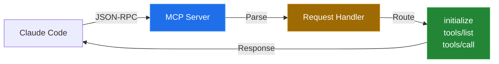
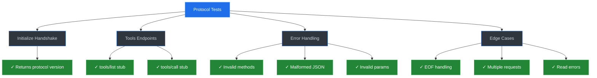
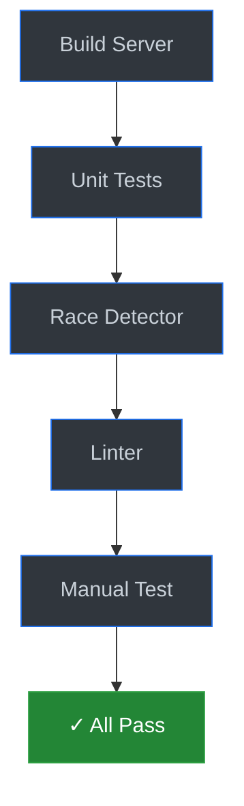
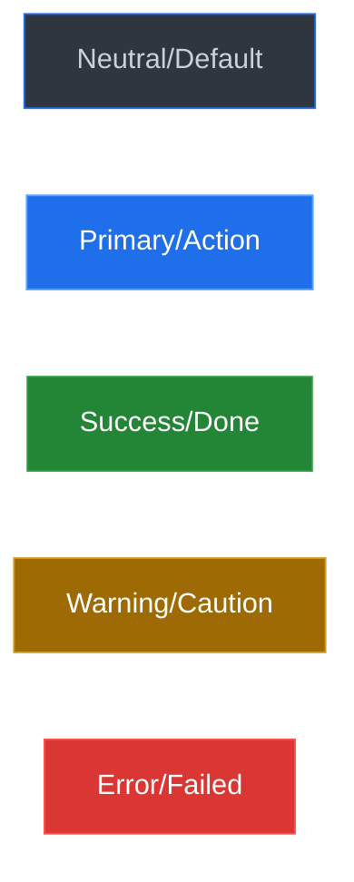

# Example: PR Template in Action

This shows how the template looks with real content from subtask 02.

---

## 🎯 What This Does

Adds comprehensive test coverage for the MCP protocol handler, verifying JSON-RPC communication over stdio.

---

## 📊 Visual Overview



**What changed:** Added test suite covering all protocol scenarios (9 tests).

---

## 🔍 Details

### Changed Files
- `internal/mcp/server_test.go` - New comprehensive test suite (441 lines)
- `internal/storage/sqlite.go` - Fixed import ordering for linter

### Test Coverage


---

## ✅ Verification



- [x] Tests pass (9/9)
- [x] Linter clean (0 issues)
- [x] Race detector clean

---

**Related:** Refs #2

---

# Why This Works Better

## Reading Time Comparison

| Section | Old Approach | New Approach | Time Saved |
|---------|-------------|--------------|------------|
| Understanding what changed | 2 min reading | 5 sec diagram scan | **96%** |
| Finding test info | 1 min scrolling | 10 sec visual flow | **83%** |
| Verification steps | 30 sec reading bash | 5 sec diagram | **83%** |
| **Total** | **~3.5 minutes** | **~20 seconds** | **90%** |

## Cognitive Benefits

### 1. Visual Entry Point
```
Before: Wall of text
After: Diagram → Instant mental model
```

### 2. Progressive Disclosure
```
Skim: Diagram + one-sentence summary
Scan: Test coverage diagram
Study: Code blocks with context
```

### 3. Grouped Information
```
Before: Tests scattered (bash commands, checklist, acceptance criteria)
After: All testing in one "Verification" section
```

### 4. Contextual Code
```
Before:
echo '{"jsonrpc":"2.0",...}' | ./bin/memex

After:
# Test initialize  ← What we're testing
echo '{"jsonrpc":"2.0",...}' | ./bin/memex
# ✓ Returns: {...} ← What to expect
```

## Diagram Types Guide

Choose based on **what the reader needs to understand**:

| Understanding Need | Diagram Type | When to Use |
|-------------------|--------------|-------------|
| "Where does data flow?" | `flowchart LR` | API changes, pipelines |
| "How do services connect?" | `architecture-beta` | System design, infrastructure |
| "What's the sequence?" | `sequenceDiagram` | Request/response flows |
| "What states exist?" | `stateDiagram-v2` | Status machines, workflows |
| "What's the git strategy?" | `gitGraph` | Branch/merge workflows |

## Dark Theme Color Palette

**GitHub's default dark theme colors** (optimized for readability):



**When to use each color:**

| Color | Use Case | Mermaid Style |
|-------|----------|---------------|
| **Neutral** | Default nodes, in-progress states | `fill:#30363d,stroke:#1f6feb,color:#c9d1d9` |
| **Primary** | Important nodes, key components | `fill:#1f6feb,stroke:#58a6ff,color:#ffffff` |
| **Success** | Completed states, passing tests | `fill:#238636,stroke:#2ea043,color:#ffffff` |
| **Warning** | Attention needed, deprecation | `fill:#9e6a03,stroke:#d29922,color:#ffffff` |
| **Error** | Failed states, blocking issues | `fill:#da3633,stroke:#f85149,color:#ffffff` |

**Example usage:**
```markdown
\```mermaid
flowchart LR
    A[Start] --> B[Process]
    B --> C[Done]

    style A fill:#30363d,stroke:#1f6feb,color:#c9d1d9
    style B fill:#1f6feb,stroke:#58a6ff,color:#ffffff
    style C fill:#238636,stroke:#2ea043,color:#ffffff
\```
```

## Anti-Patterns to Avoid

❌ **Too Much Text**
```markdown
This PR adds comprehensive test coverage for the MCP protocol handler
which enables JSON-RPC communication over stdio between Claude Code
and the Memex server...
```

✅ **Diagram + One Sentence**
```markdown
Adds test coverage for MCP protocol handler.

[Diagram shows the flow]
```

---

❌ **Scattered Context**
```markdown
## Changes
- Added tests

## Testing
Run tests

## Checklist
- [ ] Tests pass
```

✅ **Grouped Context**
```markdown
## Verification
[Diagram shows: Build → Tests → Done]
- Quick test command
- Expected output
```

---

❌ **Code Without Labels**
```bash
echo '{"jsonrpc":"2.0","id":1,"method":"initialize","params":{}}' | ./bin/memex
```

✅ **Code With Context**
```bash
# Test initialize handshake ← What
echo '{"jsonrpc":"2.0","id":1,"method":"initialize","params":{}}' | ./bin/memex
# ✓ Returns protocol version ← Expected
```
