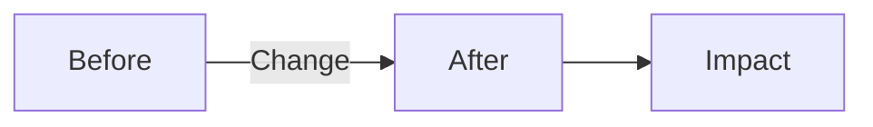
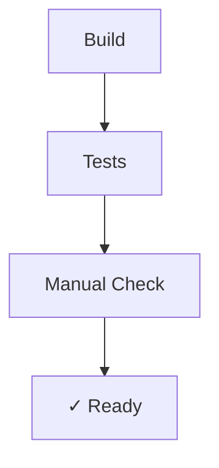

## 🎯 What This Does

<!-- One sentence: user-facing value or technical improvement -->

---

## 📊 Visual Overview



<!-- Replace with actual diagram showing:
     - Architecture changes: use architecture-beta
     - Data flow: use flowchart LR
     - State changes: use stateDiagram-v2
     - API interactions: use sequenceDiagram
-->

---

## 🔍 Details

### Changed Files
<!-- Keep to 3-5 most important files -->
- `path/to/file.go` - Brief description
- `path/to/test.go` - Added tests

### Technical Notes
<!-- Only if needed - link to issue/doc for deep dive -->

---

## ✅ Verification



**Quick Test:**
```bash
# What to run
make test

# Expected output
✓ All tests pass
```

---

## 📋 Checklist

- [ ] Tests pass
- [ ] Linter clean
- [ ] No security issues

---

**Related:** Refs #issue
