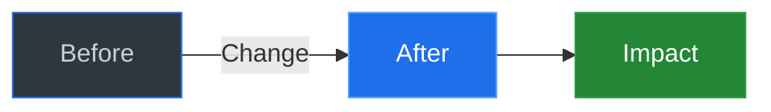
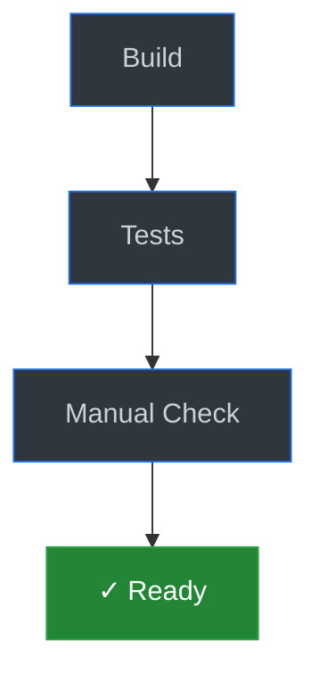

## 🎯 What This Does

<!-- One sentence: user-facing value or technical improvement -->

---

## 📊 Visual Overview

<!-- Replace with actual diagram showing:
     - Architecture changes: use architecture-beta
     - Data flow: use flowchart LR
     - State changes: use stateDiagram-v2
     - API interactions: use sequenceDiagram

     Dark theme colors (GitHub defaults):
     - Neutral: fill:#30363d,stroke:#1f6feb,color:#c9d1d9
     - Primary: fill:#1f6feb,stroke:#58a6ff,color:#ffffff
     - Success: fill:#238636,stroke:#2ea043,color:#ffffff
     - Warning: fill:#9e6a03,stroke:#d29922,color:#ffffff
     - Error: fill:#da3633,stroke:#f85149,color:#ffffff
-->

---

## 🔍 Details

### Changed Files
<!-- Keep to 3-5 most important files -->
- `path/to/file.go` - Brief description
- `path/to/test.go` - Added tests

### Technical Notes
<!-- Only if needed - link to issue/doc for deep dive -->

---

## ✅ Verification

- [ ] Tests pass
- [ ] Linter clean
- [ ] No security issues

---

**Related:** Refs #issue
